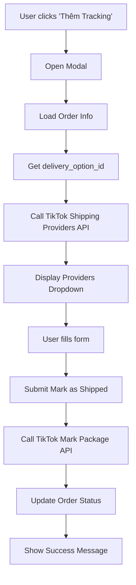

# 🚚 TikTok Shipping API Integration Guide

## 📋 Tổng quan

Hệ thống đã được tích hợp với TikTok Shipping APIs để hỗ trợ:

-   Lấy danh sách đơn vị vận chuyển từ TikTok
-   Đánh dấu gói hàng đã gửi (Mark Package As Shipped)

## 🔧 Các API đã tích hợp

### 1. **Get Shipping Providers API**

-   **Endpoint**: `GET /tiktok/shipping/orders/{orderId}/providers`
-   **Mục đích**: Lấy danh sách đơn vị vận chuyển cho một đơn hàng
-   **TikTok API**: `GET /logistics/202309/delivery_options/{delivery_option_id}/shipping_providers`

### 2. **Mark Package As Shipped API**

-   **Endpoint**: `POST /tiktok/shipping/orders/{orderId}/mark-shipped`
-   **Mục đích**: Đánh dấu gói hàng đã được gửi
-   **TikTok API**: `POST /fulfillment/202309/orders/{order_id}/packages`

### 3. **Get Order Shipping Info API**

-   **Endpoint**: `GET /tiktok/shipping/orders/{orderId}/info`
-   **Mục đích**: Lấy thông tin chi tiết đơn hàng để hiển thị form

## 🛠️ Cách sử dụng

### Frontend Integration

1. **Mở modal Mark as Shipped**:

    ```javascript
    openMarkShippedModal(orderId);
    ```

2. **Modal sẽ tự động**:

    - Load thông tin đơn hàng
    - Lấy danh sách đơn vị vận chuyển từ TikTok
    - Hiển thị sản phẩm trong đơn hàng

3. **Submit form**:
    - Nhập mã vận đơn
    - Chọn đơn vị vận chuyển
    - Chọn sản phẩm cần gửi (mặc định chọn tất cả)
    - Click "Đánh dấu đã gửi"

### API Endpoints

#### Get Shipping Providers

```bash
GET /tiktok/shipping/orders/{orderId}/providers
```

**Response**:

```json
{
    "success": true,
    "data": {
        "order_id": "123456",
        "delivery_option_id": "6955034615128000261",
        "shipping_providers": [
            {
                "id": "7117858858072016686",
                "name": "USPS"
            }
        ]
    }
}
```

#### Mark Package As Shipped

```bash
POST /tiktok/shipping/orders/{orderId}/mark-shipped
```

**Request Body**:

```json
{
    "tracking_number": "1Z999AA1234567890",
    "shipping_provider_id": "7117858858072016686",
    "order_line_item_ids": ["item1", "item2"]
}
```

**Response**:

```json
{
    "success": true,
    "message": "Đã đánh dấu gói hàng đã được gửi thành công",
    "data": {
        "order_id": "123456",
        "tracking_number": "1Z999AA1234567890",
        "shipping_provider_id": "7117858858072016686",
        "new_status": "IN_TRANSIT"
    }
}
```

## 🔐 Authentication & Authorization

### Required Scopes

-   `seller.fulfillment.basic` - Để mark package as shipped
-   `seller.logistics.basic` - Để lấy shipping providers

### Permissions

-   **Team Admin**: Có thể xử lý đơn hàng của tất cả shop trong team
-   **Seller**: Chỉ có thể xử lý đơn hàng của shop được assign

## 📊 Data Flow



## 🚨 Error Handling

### Common Errors

1. **Integration không hoạt động**:

    ```json
    {
        "success": false,
        "error": "Integration không hoạt động hoặc token đã hết hạn"
    }
    ```

2. **Không tìm thấy delivery_option_id**:

    ```json
    {
        "success": false,
        "error": "Không tìm thấy delivery_option_id trong đơn hàng"
    }
    ```

3. **Đơn hàng không ở trạng thái chờ giao hàng**:
    ```json
    {
        "success": false,
        "error": "Đơn hàng không ở trạng thái chờ giao hàng"
    }
    ```

### Validation Rules

-   **tracking_number**: Required, string, max 255 characters
-   **shipping_provider_id**: Required, string, max 255 characters
-   **order_line_item_ids**: Optional, array of strings

## 🔧 Configuration

### Environment Variables

```env
TIKTOK_SHOP_APP_KEY=your_app_key
TIKTOK_SHOP_APP_SECRET=your_app_secret
```

### Cache Settings

-   Shipping providers được cache trong 5 phút
-   Order info được cache trong 3 phút

## 📝 Logging

Tất cả API calls được log với thông tin:

-   Shop ID
-   Order ID
-   Request/Response data
-   Error messages
-   Timestamps

**Log locations**:

-   `storage/logs/laravel.log`
-   Search for: "TikTok Shipping", "Mark Package", "Shipping Providers"

## 🧪 Testing

### Test Shipping Providers API

```bash
curl -X GET "http://localhost/tiktok/shipping/orders/123/providers" \
  -H "Authorization: Bearer your_token"
```

### Test Mark as Shipped API

```bash
curl -X POST "http://localhost/tiktok/shipping/orders/123/mark-shipped" \
  -H "Content-Type: application/json" \
  -H "Authorization: Bearer your_token" \
  -d '{
    "tracking_number": "1Z999AA1234567890",
    "shipping_provider_id": "7117858858072016686"
  }'
```

## 🚀 Future Enhancements

1. **Bulk Mark as Shipped**: Xử lý nhiều đơn hàng cùng lúc
2. **Tracking Status Updates**: Tự động cập nhật trạng thái vận chuyển
3. **Shipping Label Generation**: Tạo nhãn vận chuyển tự động
4. **Delivery Confirmation**: Xác nhận giao hàng thành công
5. **Return Management**: Quản lý đơn hàng trả về

## 🆘 Troubleshooting

### Common Issues

1. **Modal không mở**:

    - Kiểm tra console errors
    - Đảm bảo order có trạng thái AWAITING_SHIPMENT
    - Kiểm tra shipping_type là SELLER

2. **Không load được shipping providers**:

    - Kiểm tra delivery_option_id trong order_data
    - Kiểm tra TikTok API credentials
    - Kiểm tra network connection

3. **Mark as shipped thất bại**:
    - Kiểm tra tracking number format
    - Kiểm tra shipping provider ID
    - Kiểm tra TikTok API response

### Debug Commands

```bash
# Check TikTok API credentials
php artisan tinker
>>> config('tiktok-shop.app_key')

# Test signature generation with real data
>>> $order = App\Models\TikTokOrder::find(123);
>>> $deliveryOptionId = $order->order_data['delivery_option_id'];
>>> App\Services\TikTokSignatureService::generateShippingProvidersSignature('app_key', 'app_secret', time(), 'shop_cipher', $deliveryOptionId)

# Test shipping signature with real order
php artisan test:shipping-signature 123

# Check order data
>>> App\Models\TikTokOrder::find(123)->order_data
```

### Common Issues

1. **Invalid signature error (106001)**:

    - Đảm bảo sử dụng `delivery_option_id` thực tế trong signature
    - Kiểm tra app_key và app_secret
    - Kiểm tra timestamp (phải là Unix timestamp)

2. **Missing delivery_option_id**:

    - Kiểm tra order_data có chứa delivery_option_id
    - Đảm bảo đơn hàng được sync đầy đủ từ TikTok

3. **Package not found error (21011001)**:
    - **Nguyên nhân chính**: Sử dụng database order ID thay vì TikTok order ID
    - **Giải pháp**: Đảm bảo sử dụng `$order->order_id` (TikTok order ID) thay vì `$order->id` (database ID)
    - **Debug**: Sử dụng command `php artisan test:order-data {database_order_id}` để kiểm tra

## 📞 Support

Nếu gặp vấn đề, hãy check:

1. TikTok API credentials
2. Shop integration status
3. Order data structure
4. Network connectivity
5. Log files for detailed errors
